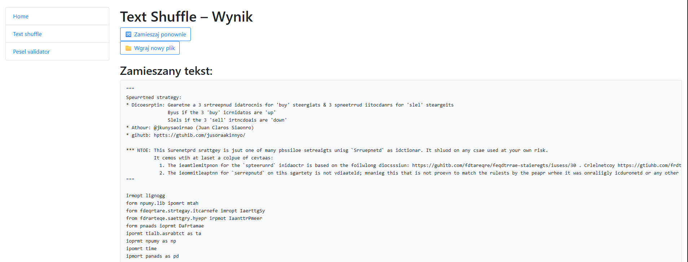

# 🧠 Django TextShuffle & PESEL Validator

### Projekt  Django składający się z dwóch niezależnych aplikacji:

### TextShuffle 
umożliwia przesłanie pliku .txt, przetwarza jego treść poprzez przemieszanie liter wewnątrz każdego wyrazu (z zachowaniem pierwszej i ostatniej litery).

### PESEL Validator 
pozwala użytkownikowi wpisać numer PESEL i zwraca informację o poprawności, dacie urodzenia i płci.

### Projekt działa bez bazy danych – dane przetwarzane są wyłącznie w pamięci, bez trwałego zapisu.

## 🚀 Funkcjonalności

### 🔹TextShuffle
 - Przesyłanie pliku .txt
 - Walidacja formatu pliku
 - Przetwarzanie tekstu – mieszanie liter w słowach
 - Zachowanie interpunkcji i formatowania
 - Wyświetlenie wyniku na stronie
 - możliwość ponownego przemieszania

### 🔹 PESEL Validator
 - Formularz wprowadzania numeru PESEL
 - Walidacja długości, sumy kontrolnej i poprawności daty
 - Odczyt daty urodzenia i płci z numeru PESEL
 - Informacja zwrotna o poprawności


## ⚙️ Technologie

 - Python 3.12+
 - Django 5.x
 - HTML + Django Templates
 - Brak bazy danych - logika oparta o formularze i funkcje


## 🛠️ Instalacja i uruchomienie

### 1️⃣ Klonowanie repozytorium
```bash
git clone https://github.com/folg-code/textshuffle-peselvalidator.git
cd textshuffle-peselvalidator
```

### 2️⃣ Stworzenie i aktywacja środowiska wirtualnego
```bash
python -m venv .venv
# Windows
.venv\Scripts\activate
# Linux / macOS
source .venv/bin/activate
```

### 3️⃣ Instalacja zależności
```bash
pip install -r requirements.txt
```


### 4️⃣ Uruchomienie serwera
```bash
python manage.py runserver
```

### 🐳 (Opcjonalnie) Uruchomienie w Dockerze
```bash
docker build -t textshuffle-peselvalidator .
docker run -p 8000:8000 textshuffle-peselvalidator
```

## 📸 Zrzuty ekranu




